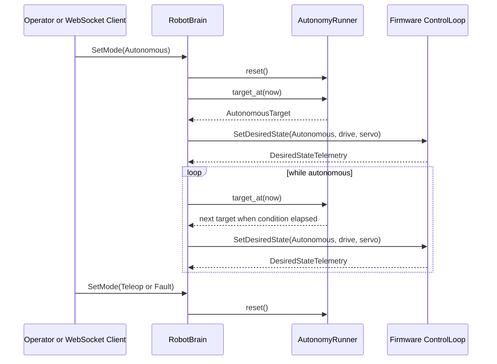
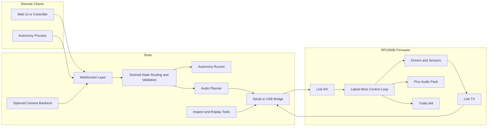

# Architecture

## Overview

`mortimmy` is split into a small set of focused Rust packages with a hard boundary between deterministic embedded control and host-side orchestration.

- The RP2350B firmware owns real-time I/O, safety enforcement, audio output, and direct peripheral control.
- The Raspberry Pi host owns networking, routing, telemetry fanout, capture tooling, and future camera integration.
- Shared crates carry the protocol, units, limits, and driver abstractions so both sides evolve against the same contract.

The current codebase is still an implementation scaffold rather than a complete robot stack, but the package boundaries are now aligned with the active hardware direction: Pimoroni Pico LiPo 2, Pico Audio Pack, and Trellis M4 4x4.

The active control design is now centered on a desired-state control plane:

- the host brain owns the latest desired mode, drive, and servo targets
- the firmware owns the latest applied control state and enforces safety locally
- one-shot actions such as ping, parameter updates, audio chunks, and Trellis LED updates stay outside that continuous-control path

## Repository Layout

```text
.
├── Cargo.toml
├── crates/
│   ├── core/             # shared units, limits, modes, and errors
│   ├── drivers/          # hardware-facing traits used by embedded code
│   └── protocol/         # postcard schema, CRC policy, COBS framing, decoder
├── firmware/
│   └── rp2350/           # no_std firmware target for the Pimoroni Pico LiPo 2
├── host/
│   ├── mortimmy/         # runtime daemon for serial/USB, routing, telemetry, config
│   └── tools/            # capture inspection and replay tooling
├── integration_test/     # protocol and future live-hardware integration harness
└── docs/
    └── src/
```

## Shared Crates

### `crates/core`

This crate provides the shared language for the rest of the workspace:

- `Mode` for robot operating states such as teleop, autonomous, and fault
- units such as millimeters, milliseconds, PWM ticks, and servo ticks
- safety-oriented defaults such as command timeout and motion limits
- common error types that can cross the firmware-host boundary

The goal is to keep protocol logic and driver traits free from duplicated constants or host-only assumptions.

### `crates/protocol`

The protocol crate defines the shared wire contract.

- Serialization uses `postcard` so the message layer stays compact and `no_std` friendly.
- Frame transport uses CRC16 plus COBS encoding so framed packets can survive arbitrary zero bytes on USB CDC, UART, and captured byte streams.
- `FrameDecoder` provides stream-oriented resynchronization at the byte level for host tools and future serial/USB bridges.

Current message families include:

- `messages::commands` for desired-state snapshots, parameter updates, audio forwarding, Trellis LED writes, status requests, and ping
- `messages::telemetry` for desired-state acknowledgements, status, range, battery, audio status, Trellis pad events, and pong replies
- `WireMessage` as the top-level direction tag shared by both families

The shared protocol page at [protocol.md](protocol.md) documents the framing contract and message surface in more detail.

### `crates/drivers`

Driver traits define the embedded-facing APIs for the first hardware layer:

- motor control
- servo positioning
- ultrasonic distance sensing
- audio output
- Trellis keypad and LED matrix interaction

These traits stay intentionally small so the real firmware can depend on trait contracts rather than concrete board wiring.

## Embedded Firmware

The active firmware target is `firmware/rp2350` and is built around the Embassy ecosystem.

- `embassy-rp` provides the RP2350B integration layer with the `rp235xb` feature enabled.
- `embassy-usb` provides the runtime USB CDC transport used by the live serial path.
- `panic-probe` is used from the start so embedded panics remain debugger-friendly.
- `defmt` and `defmt-rtt` are included for compact embedded logging and RTT inspection.

The crate currently centers around a `FirmwareScaffold` that aggregates:

- board profile information for the Pimoroni Pico LiPo 2
- control-loop and safety state
- link receive and transmit task placeholders
- sensor sampling task placeholders
- USB transport scaffolding
- audio output state for the Pico Audio Pack
- Trellis keypad and LED state for the Trellis M4 4x4
- direct protocol command application and telemetry snapshot helpers for host-free unit testing
- a deterministic bring-up report that is emitted over `defmt` during boot and reused by host-side tests

The embedded control plane now has a single latest-wins apply path for continuous motion:

- `ControlLoop::apply_desired_state` applies mode, drive, and servo together
- stale motion still times out in firmware, even if the host misbehaves
- one-shot commands stay outside that continuous-control path

### Board Profile

The current embedded board profile encodes the repository's active target assumptions:

- board: Pimoroni Pico LiPo 2
- MCU: RP2350B
- flash: 16 MiB
- PSRAM: 8 MiB
- built-in USB-C, Qw/ST, and LiPo charging support

### Embedded Safety Model

The safety model remains firmware-first:

- motors start disabled
- stale commands should stop motion quickly
- the MCU remains the final enforcement point for limits even if the host clamps first
- board bring-up for audio and Trellis should not weaken the core motion-safety path

One key semantic change is that `stationary teleop` is now the normal stopped state, while `fault` is reserved for safety failures and explicit fault requests.

- a desired state with zero drive leaves the robot in `teleop` with zero motor output
- link timeout or another safety failure resets the scaffold and enters `fault`
- when the host reconnects, it reasserts its last requested `teleop` or `autonomous` mode

### Bring-Up And Debug Path

- `.cargo/config.toml` links the RP2350 build with `link.x`, `defmt.x`, and `--nmagic` so the generated ELF is directly usable by probe-rs tooling and UF2 conversion.
- `firmware/rp2350/memory.x` encodes the active Pico LiPo 2 memory map: 16 MiB XIP flash at `0x10000000` and 520 KiB SRAM at `0x20000000`.
- `firmware/rp2350/build.rs` copies `memory.x` into the linker search path so repo-root workspace builds produce the same valid image as crate-local builds.
- `mortimmy-tools deploy firmware` now covers the full bring-up loop: build ELF, print artifacts, convert to UF2, deploy through `picotool` when the RP2350 BOOTSEL interface is visible, fall back to a BOOTSEL-mounted Pico volume when it is not, flash through the native `probe-rs` library, and hand off defmt/RTT monitoring to `probe-rs run`.
- The current boot path is intentionally safe for bench testing without peripherals: it logs the board profile and default task state, then waits in a safe zero-drive `teleop` state for desired-state traffic.
- A successful USB-only BOOTSEL upload boots into the runtime USB CDC path; the host can then reconnect over the normal serial backend once the device enumerates.

## Host Runtime

The main host runtime is `host/mortimmy`. It runs as a normal `std` Rust program and owns the system integration work that does not belong on the microcontroller.

Current subsystem seams:

- `cli` provides `start` and `config` subcommands
- `config` loads and persists a nested TOML config file
- `brain` owns the high-level robot loop, transport selection, and telemetry handling
- `brain::autonomy` provides a safe hardcoded autonomous runner that already uses desired-state sequencing and is shaped for future websocket-fed plans
- `input` converts operator backends such as the keyboard into shared high-level brain commands
- `routing` clamps and validates outbound commands against shared limits
- `serial`, `telemetry`, and `websocket` define the transport and fanout boundaries
- `audio` plans waveform chunking for the firmware bridge
- `camera` provides the optional `nokhwa` seam for Linux and macOS camera backends

The host runtime stack is intentionally conventional:

- `tokio` for async execution
- `tokio-tungstenite` for WebSocket support
- `tokio-serial` for serial I/O
- `tracing` and `tracing-subscriber` for logs

The currently validated control-loop proof is the `loopback` transport backend. It reuses the same host framing code as the live `serial` path, but exchanges bytes with `FirmwareScaffold` in-process so protocol work can still be exercised when hardware is not attached or not in BOOTSEL mode.

## Desired-State Brain Model

The host brain now owns a single desired snapshot:

- desired mode
- desired drive intent
- desired servo target

Keyboard input mutates that desired snapshot in teleop mode. Autonomous mode mutates it through a small step runner with explicit step conditions. The runner currently ships with a safe default servo-scan plan so autonomous mode exercises sequencing without commanding blind drive motion.

On transport loss, the controller times out into `fault` and resets to a safe failed state. The host keeps the last requested mode and reasserts it on reconnect.

That split is deliberate:

- runtime robot behavior is modeled as a runtime state machine because the current mode can change based on user input, reconnects, telemetry, and future websocket commands
- typestate is used more selectively for driver initialization, builder-style setup, and API contracts that must be impossible to misuse at compile time

## Autonomy Flow



## Typestate And State Machines

The embedded Rust typestate pattern is still important, but it is not applied uniformly.

- Use typestate for configuration and ownership boundaries where an invalid sequence should not compile.
- Use runtime enums and explicit transition functions for robot modes, autonomy plans, and control-loop state that must react to live input and telemetry.
- Keep driver traits small and stateful helpers explicit so firmware code can apply one desired state through one owner rather than through many partially overlapping methods.

This keeps compile-time guarantees where they help most without forcing dynamic robot behavior into a compile-time shape that would be hard to evolve once websocket-driven autonomy arrives.

## Operational Tools

`host/tools` is now shaped around the same shared protocol rather than placeholder logging only.

- `inspect` parses a recorded capture and reports frame and message counts using the real framing decoder
- `replay` reuses the same capture parsing path and is positioned to become the live replay bridge for hardware testing

This keeps host operations, test fixtures, and the runtime transport all tied to the same wire contract.

## Integration Harness

The root `integration_test` crate exists to keep integration coverage separate from unit-level crates.

- portable protocol roundtrip tests validate the postcard plus COBS framing contract
- ignored smoke tests define the shape of live USB/audio/Trellis checks
- `MORTIMMY_HW_CONFIG` allows live hardware runs to load a serial device and capability expectations without hard-coding them into the test suite
- a checked-in sample hardware config at `integration_test/hardware.example.toml` gives the no-peripheral Pico bring-up flow a stable starting point

## End-To-End Flow

The intended runtime path is:

1. A local operator, autonomous runner, or future websocket client updates the host-owned desired state.
2. The host validates and clamps that desired state against shared limits.
3. The host serializes the snapshot with `postcard`, wraps it with CRC16 plus COBS framing, and forwards it over the selected transport backend.
4. The firmware verifies the frame, applies the latest desired state, and enforces safety locally.
5. Sensor, audio, and keypad telemetry flows back through the same shared protocol to the host.
6. The host fans telemetry out to WebSocket clients and future tooling or replay pipelines.



## Operational Notes

- The host daemon is intended to run locally on macOS for development and directly on Raspberry Pi for deployment.
- The active embedded target is checked with `thumbv8m.main-none-eabihf` through the pinned toolchain.
- RP2350 firmware can now be exercised either through a BOOTSEL UF2 upload, preferably via `picotool` on macOS, or through probe-rs with chip `RP235x` when a debug probe is attached.
- The host `start` command now supports both loopback and live USB CDC serial transports.
- The RP2350 firmware now includes an Embassy USB CDC executor task that applies framed commands through `FirmwareScaffold` and emits telemetry responses.
- Continuous control now flows through `SetDesiredState`, and the host runs a safe built-in autonomous servo-scan plan when autonomous mode is selected.
- The future websocket path should inject autonomy plans into the host brain rather than bypassing the desired-state owner.
- Documentation is built from `docs/src/` with `mdbook build docs`.

