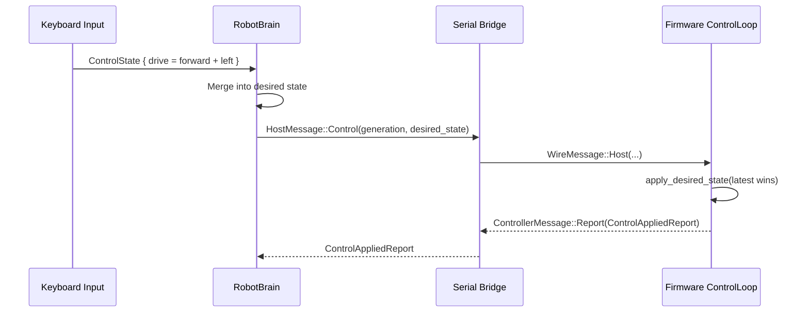
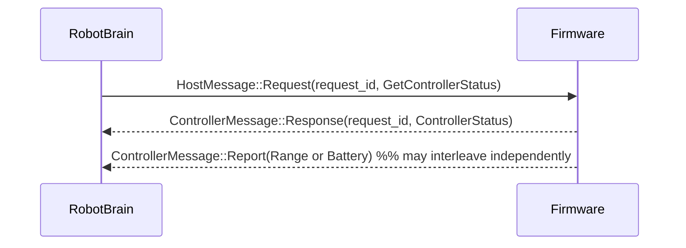

# Protocol

The shared protocol is the contract between the Raspberry Pi host and the RP2350 firmware.

## Goals

- Keep the wire format `no_std` friendly so the same types compile on both host and firmware.
- Keep transport framing resilient to arbitrary byte streams over USB CDC, UART, and recorded captures.
- Keep continuous control idempotent so firmware can apply the latest intent safely even when messages are retried or interleaved with one-shot actions.

## Transport

- Message payloads are serialized with `postcard`.
- Each payload is wrapped with a small header containing protocol version, sequence number, and payload length.
- A CRC16 protects the header plus payload.
- The resulting bytes are COBS-encoded and terminated with a zero delimiter.

This lets the host and firmware recover from partial reads, framing loss, and captured-stream replay without introducing heap allocation.

The protocol runs in two concrete bring-up modes:

- loopback, where the host exchanges framed bytes with `FirmwareScaffold` in-process
- live USB CDC, where the RP2350 Embassy task reads framed bytes from the CDC ACM class and writes controller messages back to the host serial backend

The Rust API is grouped the same way:

- `mortimmy_protocol::messages::host` contains host-originated control and request envelopes
- `mortimmy_protocol::messages::commands` contains reusable desired-state, parameter, audio, and Trellis payload types
- `mortimmy_protocol::messages::controller` contains controller-originated response, report, and event envelopes
- `mortimmy_protocol::messages::telemetry` contains the reusable controller status, control-applied, range, battery, audio, and keypad payload types

## Message Families

Host-to-firmware traffic is split into two semantic families:

- latest-wins control through `HostMessage::Control`
- correlated one-shot requests through `HostMessage::Request`

The continuous-control envelope includes:

- `generation`
- a full desired-state snapshot containing `mode`, `drive`, and `servo`

The host owns that snapshot and resends it while continuous control is active. The firmware treats it as latest-wins state rather than as a queue of imperative motion commands.

Host-to-firmware command coverage therefore includes:

- full desired-state updates for teleop and autonomous control
- explicit controller status requests through `GetControllerStatus`
- typed parameter updates for safety limits and subsystem tuning
- audio chunk forwarding for the Pico Audio Pack
- Trellis LED updates
- report cadence configuration through `ConfigureReports`

Controller-to-host traffic is split into three semantic families:

- `ControllerMessage::Response` for correlated replies to host requests
- `ControllerMessage::Report` for decoupled controller-originated data with independent cadence
- `ControllerMessage::Event` for immediate controller-originated events

The main controller data products are:

- `ControllerStatus`, returned as a request response and scoped to controller identity and health only
- `ControlAppliedReport`, emitted as a report with applied mode, drive state, servo state, last control-plane error, and the last applied control `generation`
- range and battery measurements as dedicated reports
- audio queue state as a dedicated report or request response
- Trellis pad input as a controller event

Status snapshots do not embed range data, and control-applied reports do not duplicate sensor snapshots. Sensor data has its own report path.

## Why Full Desired State messages?

The control message is intentionally a full message rather than a field patch.

- The payload is small enough for postcard plus COBS framing over USB CDC.
- A full snapshot keeps merge semantics trivial: the firmware only needs to remember the latest desired state.
- `teleop + zero drive` stays distinct from `fault`, which owns timeout and safe-stop recovery.
- Tests can assert one idempotent apply path instead of reasoning about ordering between `SetMode`, `Drive`, `Servo`, and `Stop`.

For this control surface, the full-snapshot model keeps merge semantics simple and safe.

## Teleop Sequence

## Status Request Sequence

Status reads are explicit correlated requests rather than being coupled to control acknowledgements.

## Audio Chunk Contract

The default host and firmware chunk size is `240` PCM samples. The protocol payload ceiling is sized so that one default chunk can be serialized and framed without an additional fragmentation layer.

That alignment matters because the host audio planner, firmware audio queue, and wire contract all need to agree on the same chunk size before live audio forwarding is possible.

## Firmware Integration

The firmware scaffold applies protocol traffic directly into the control, audio, Trellis, and sensor task state.

Continuous control has a single apply path:

- `ControlLoop::apply_desired_state` owns the combined mode, drive, and servo update
- `FirmwareScaffold::handle_host_message` maps host control traffic into that path and emits `ControlAppliedReport`
- the latest desired state replaces the previous desired state instead of stacking multiple motion commands

- limit-related parameter updates change the embedded control loop and watchdog budget
- audio and Trellis parameter updates reconfigure the corresponding scaffold tasks
- correlated requests emit explicit controller responses
- range, battery, audio queue state, and controller-originated data use dedicated report or event paths instead of being embedded into status snapshots
- invalid control data is surfaced as `CoreError::InvalidCommand` in the corresponding response or control-applied report

`FirmwareScaffold` is the shared apply surface used by unit tests and the live USB CDC runtime, so the protocol is executable inside the firmware crate rather than existing only as schema definitions.

On the host side, the keyboard backend and autonomous runner drive this same protocol path through the brain loop. Sustained control is expressed as one desired snapshot rather than a sequence of imperative motion messages.
