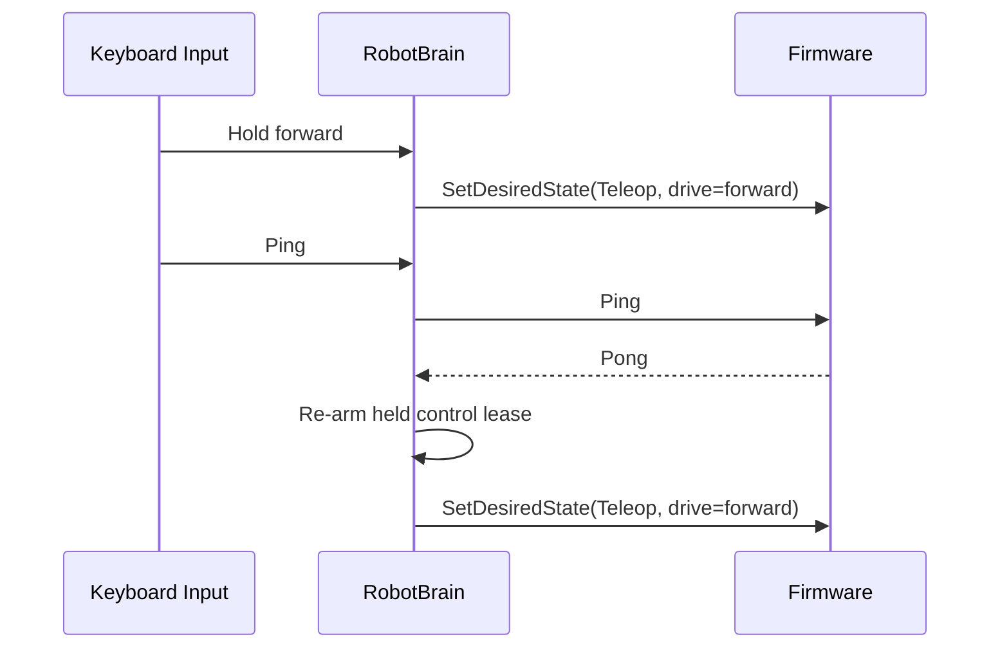

# Protocol

The shared protocol is the contract between the Raspberry Pi host and the RP2350 firmware.

## Goals

- Keep the wire format `no_std` friendly so the same types compile on both host and firmware.
- Keep transport framing resilient to arbitrary byte streams over USB CDC, UART, and recorded captures.
- Keep continuous control idempotent so firmware can apply the latest intent safely even when messages are retried or interleaved with one-shot actions.

## Transport

- Message payloads are serialized with `postcard`.
- Each payload is wrapped with a small header containing protocol version, sequence number, and payload length.
- A CRC16 protects the header plus payload.
- The resulting bytes are COBS-encoded and terminated with a zero delimiter.

This lets the host and firmware recover from partial reads, framing loss, and captured-stream replay without introducing heap allocation.

The protocol now runs in two concrete bring-up modes:

- loopback, where the host exchanges framed bytes with `FirmwareScaffold` in-process
- live USB CDC, where the RP2350 Embassy task reads framed bytes from the CDC ACM class and writes telemetry responses back to the host serial backend

The Rust API is grouped the same way:

- `mortimmy_protocol::messages::commands` contains host-to-firmware command types
- `mortimmy_protocol::messages::telemetry` contains firmware-to-host telemetry types plus related capability/status enums

## Current Message Families

Host-to-firmware traffic is now split into two semantic families:

- continuous desired-state snapshots through `Command::SetDesiredState`
- one-shot actions such as `Ping`, `SetParam`, `PlayAudio`, and `SetTrellisLeds`

The desired-state message is a full snapshot:

- `mode`
- `drive`
- `servo`

The host owns that snapshot and resends it while continuous control is active. The firmware treats it as latest-wins state rather than as a queue of imperative motion commands.

Host-to-firmware command coverage therefore includes:

- full desired-state updates for teleop and autonomous control
- typed parameter updates for safety limits and subsystem tuning
- audio chunk forwarding for the Pico Audio Pack
- Trellis LED updates
- explicit status requests through `GetStatus`
- link-health `ping`

Firmware-to-host telemetry covers:

- desired-state acknowledgements containing the applied mode, drive state, servo state, and last control-plane error
- status snapshots with mode, link quality, and the last control-plane error
- range and battery measurements
- audio queue state
- Trellis pad events
- `pong` replies

## Why Full Snapshots

The control snapshot is intentionally a full message rather than a field patch.

- The payload is small enough for postcard plus COBS framing over USB CDC.
- A full snapshot keeps merge semantics trivial: the firmware only needs to remember the latest desired state.
- `teleop + zero drive` stays distinct from `fault`, which owns timeout and safe-stop recovery.
- Tests can assert one idempotent apply path instead of reasoning about ordering between `SetMode`, `Drive`, `Servo`, and `Stop`.

If payload pressure ever becomes real, an explicit patch message can be added later. For the current control surface, the simpler model is the safer one.

## Teleop Sequence

```mermaid
sequenceDiagram
	participant Input as Keyboard Input
	participant Brain as RobotBrain
	participant Link as Serial Bridge
	participant FW as Firmware ControlLoop

	Input->>Brain: ControlState { drive = forward + left }
	Brain->>Brain: Merge into desired state
	Brain->>Link: Command::SetDesiredState(Teleop, drive, servo)
	Link->>FW: WireMessage::Command(...)
	FW->>FW: apply_desired_state(latest wins)
	FW-->>Link: Telemetry::DesiredState(...)
	Link-->>Brain: DesiredStateTelemetry
```

## Mixed Ping Sequence

`Ping` remains a one-shot command, but it no longer owns motion state. The host keeps the latest desired snapshot and resumes refreshing it after the one-shot roundtrip completes.



## Audio Chunk Contract

The default host and firmware chunk size is `240` PCM samples. The protocol payload ceiling is sized so that one default chunk can be serialized and framed without an additional fragmentation layer.

That alignment matters because the host audio planner, firmware audio queue, and wire contract all need to agree on the same chunk size before live audio forwarding is possible.

## Firmware Integration

The firmware scaffold now applies protocol traffic directly into the control, audio, Trellis, and sensor task state.

Continuous control now has a single apply path:

- `ControlLoop::apply_desired_state` owns the combined mode, drive, and servo update
- `FirmwareScaffold::handle_command` acknowledges that path with `Telemetry::DesiredState`
- the latest desired state replaces the previous desired state instead of stacking multiple motion commands

- limit-related parameter updates change the embedded control loop and watchdog budget
- audio and Trellis parameter updates reconfigure the corresponding scaffold tasks
- accepted commands emit immediate state telemetry where that is useful for bring-up tests
- invalid control data is surfaced as `CoreError::InvalidCommand` in status telemetry

This is still scaffold-level behavior rather than the full executor-driven runtime, but it means the shared protocol is now executable inside the firmware crate rather than existing only as schema definitions.

On the host side, the keyboard backend and autonomous runner now drive this same protocol path through the brain loop. A simple `ping` still roundtrips through shared framing and returns `pong`, but sustained control is now expressed as one desired snapshot rather than a sequence of imperative motion messages.
